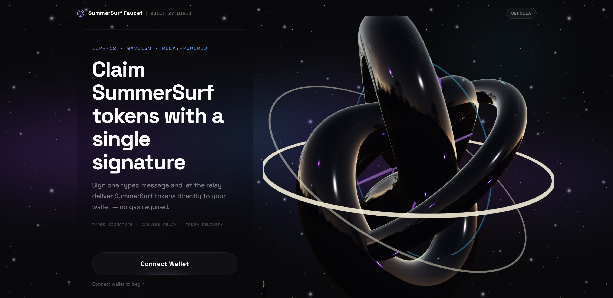
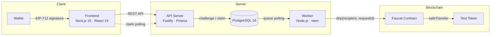
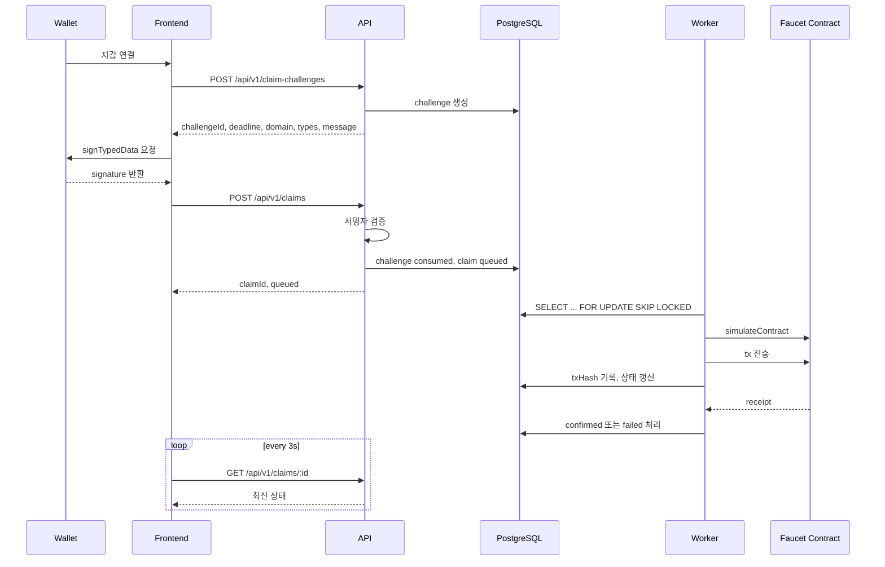
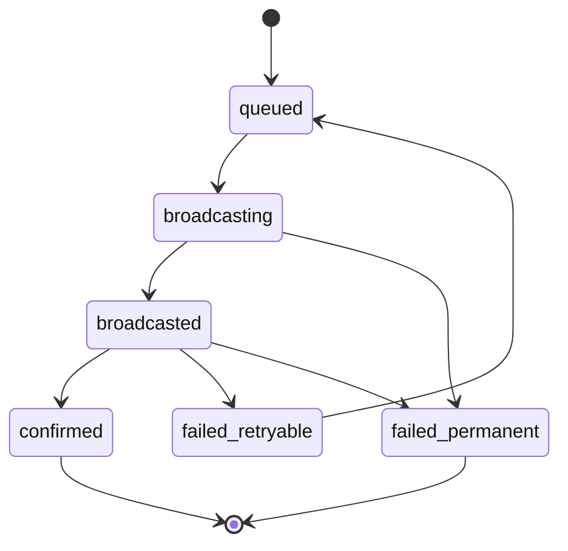
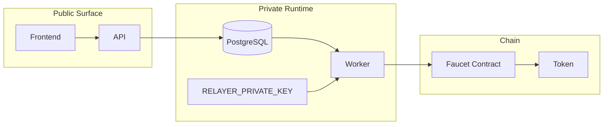
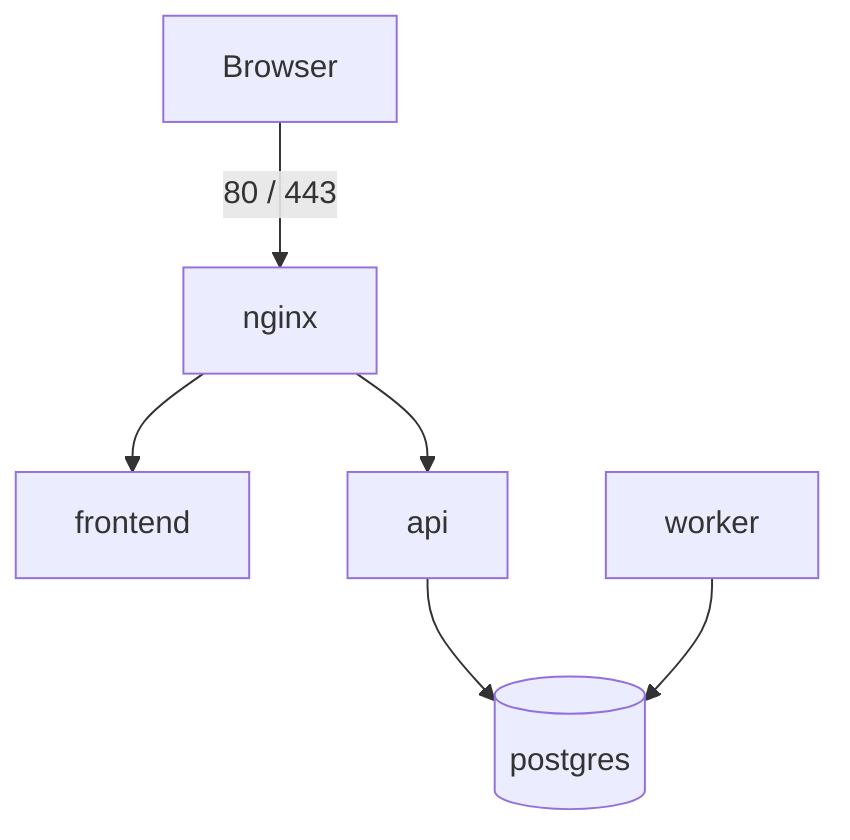

<div align="center">

# SummerSurf Faucet

EIP-712 Typed Signature Relay Faucet

서명 한 번으로 테스트 토큰을 받는, 가스비 없는 relay faucet

Preview: http://52.79.205.207

[](https://soliditylang.org/)
[](https://www.typescriptlang.org/)
[](https://nextjs.org/)
[](https://react.dev/)
[](https://book.getfoundry.sh/)


</div>

<p align="center">
  
</p>


<br/><br/><br/>

# Architecture


SummerSurf Faucet은 사용자가 EIP-712 typed data에 서명하면, API가 그 서명을 검증하고 claim을 큐에 기록한 뒤, 별도의 worker가 온체인 트랜잭션을 전송하는 풀스택 시스템입니다. 브라우저는 서명과 상태 조회만 담당하고, 실제 gas 비용은 relay 계층이 처리합니다.


이 구조를 선택한 이유는 책임을 명확하게 분리하기 위해서입니다. API는 검증과 큐잉만 담당하고, worker만 private key를 보유하며, 최종 규칙은 온체인 contract가 강제합니다. 이 경계가 분명해야 공개 배포 환경에서도 브라우저와 서버에 노출되는 정보 범위를 통제할 수 있다고 생각하였습니다.




핵심은 브라우저, API, worker, contract가 한 줄로 이어져서 보이더라도 실제 역할은 섞이지 않는다는 점입니다. 특히 relay key는 worker에만 머무르고, client에는 정규화된 상태만 반환합니다.

<p align="center">
  
</p>


<br/><br/>

# Data Flow


한 건의 claim은 challenge 발급, typed signature, claim 생성, worker 처리, receipt 확인의 순서로 흘러갑니다. challenge와 claim을 분리해 두면 one-time 서명 흐름을 안전하게 유지할 수 있고, 사용자가 실제로 어떤 데이터에 서명하는지도 지갑에서 더 분명하게 확인할 수 있습니다.


Frontend는 claim 생성 직후 트랜잭션을 바로 확정된 것으로 취급하지 않습니다. claim id를 기준으로 상태를 polling하고, worker가 broadcast와 confirmation을 마칠 때까지 최신 상태를 계속 반영합니다. 이러한 구조 덕분에 브라우저와 비동기 relay 처리 계층이 자연스럽게 연결됩니다.





<br/><br/>

# Claim State Machine


Claim은 단순히 queued와 confirmed만 오가는 구조가 아니고, relay 실패, receipt 지연, dropped transaction, retryable failure를 정상적인 운영 시나리오로 보고 상태 머신을 설계했습니다. 이 결정이 있어야 worker가 중간 실패를 단순 예외가 아니라 복구 가능한 흐름으로 다룰 수 있다고 생각했습니다.


`failed_retryable`과 `failed_permanent`를 분리한 이유도 여기에 있는데 일시적인 RPC 문제나 receipt 지연, gas 조건 변화는 다시 시도할 수 있지만 simulation 단계에서 이미 contract가 거부한 요청은 재시도해도 성공하지 않기 때문입니다.





<br/><br/>

# Trust Boundary


이 시스템에서 가장 중요한 경계는 relay key가 어디까지 노출되느냐입니다. API는 key를 만지지 않고, worker만 key를 보유하며, 브라우저에는 최소한의 정보만 전달합니다. 이 원칙은 코드 구조와 인프라 구성 모두에 반영해서 구현할 수 있도록 노력하였습니다.


Docker Compose에서도 `RELAYER_PRIVATE_KEY`는 worker 컨테이너에만 주입됩니다. API가 compromise되더라도 relay key로 바로 이어지지 않도록 공부해서 설계한 후에 구현을 하였고 client에는 내부 RPC나 raw failure message 같은 운영 세부정보를 넘기지 않도록 하였스비다.





<br/><br/>

# Design Principles


- Separation of concerns: API는 challenge 발급, 서명 검증, claim 생성만 담당합니다. worker는 queue를 처리하고 트랜잭션을 전송합니다. contract는 온체인 규칙을 강제합니다.
- Defense in depth: off-chain validation과 on-chain invariant를 함께 둡니다. requestId 중복 방지, cooldown, epoch budget 같은 핵심 제약은 contract가 최종적으로 보장합니다.
- Failure-aware processing: dropped tx, orphaned tx, lease expiry, retryable failure를 예외적인 상황이 아니라 정상적인 운영 시나리오로 취급합니다.
- Minimal public surface: client에는 정규화된 failure code와 최소 상태만 노출하고, 내부 구현 세부사항은 서버 로그와 내부 상태에 남깁니다.
- Shared chain metadata: frontend, API, worker가 동일한 chain 기준을 보도록 `@eip712-faucet/shared`에 타입과 메타데이터를 모읍니다.


<br/><br/>

# Security & Hardening


공개 배포를 전제로, 단순히 기능이 동작하는 수준을 넘어 브라우저와 edge에 노출되는 정보를 줄이는 방향으로 구현했습니다. 처음엔 DevTools를 막아야 하는것 아닌가 하는 고민도 했지만 이 프로젝트에서 하드닝은 DevTools를 막는 문제가 아니라, 브라우저에 무엇을 보내지 않을 것인가를 정하는 문제에 가깝다고 느껴 구현 방향을 결정하였습니다.


| Decision | Effect |
|---|---|
| Generic error handler | 예외 발생 시 stack trace 대신 정규화된 500 응답만 반환합니다. |
| `disableRequestLogging` | HTTP 요청 메타데이터 자동 로그를 제거합니다. |
| `failureMessage` 제거 | raw RPC/provider 에러 문자열을 브라우저에 노출하지 않습니다. |
| Public failure code 정규화 | 클라이언트에는 `REJECTED` / `SERVICE_BUSY`만 전달합니다. |
| Faucet status 응답 축소 | `eligible`, `reasonCode`, `nextClaimAt`, `dripAmount`만 공개합니다. |
| HMAC 기반 IP 저장 | raw IP를 저장하지 않고 anti-abuse 용도로만 해시를 사용합니다. |
| Production source map 비활성화 | 브라우저에서 bundle 내부 정보 노출을 최소화합니다. |
| Self-hosted fonts + stricter CSP | 외부 폰트 의존을 제거하고 header 정책을 강화합니다. |
| `/readyz` 제거 | 외부에서 내부 상태를 유추할 수 있는 표면을 줄입니다. |


공개 배포 하드닝의 자세한 설계 근거는 [Public Deploy Hardening Spec](docs/superpowers/specs/2026-04-03-public-deploy-hardening-design.md)에 정리해 두었습니다.


<br/><br/>

# Project Structure

```text
eip712-relayer-faucet/
├── apps/
│   ├── api/
│   │   ├── src/routes
│   │   ├── src/lib
│   │   └── prisma
│   ├── worker/
│   │   └── src
│   └── frontend/
│       └── src
├── packages/
│   └── shared/
├── contracts/
│   ├── src/
│   ├── test/
│   └── script/
├── infra/
│   ├── docker/
│   └── nginx/
└── docs/
```

레이어를 나눈 이유는 각 계층의 책임과 실패 지점을 분명하게 만들어야 장애를 추적하기 쉽고, 공개 배포 환경에서도 어느 계층이 어떤 비밀과 상태를 가져야 하는지 명확해지기 때문입니다.

- `apps/api`: challenge 발급, EIP-712 검증, claim 생성, status API를 담당합니다.
- `apps/worker`: claim 선점, simulation, broadcast, receipt 확인, retry 처리를 담당합니다.
- `apps/frontend`: 지갑 연결, typed signature, claim polling, landing UI를 담당합니다.
- `packages/shared`: 공유 타입, 상수, 체인 메타데이터를 담습니다.
- `contracts`: Faucet와 token, Foundry 테스트, 배포 스크립트를 포함합니다.
- `infra`: Docker Compose, nginx, TLS, CSP 구성을 담습니다.


<br/><br/>

# Tech Stack

| Layer | Stack |
|---|---|
| Smart contracts | Solidity 0.8.27, OpenZeppelin v5, Foundry |
| API | Fastify, TypeScript, Prisma |
| Worker | Node.js, TypeScript, viem |
| Frontend | Next.js 15, React 19, wagmi, RainbowKit, viem |
| 3D scene | React Three Fiber v9, drei v10, Three.js |
| Database | PostgreSQL 16 |
| Infra | Docker Compose, nginx |
| Monorepo | pnpm workspaces |
| Typography | Space Grotesk, Space Mono |

API와 worker는 같은 TypeScript 타입 계층을 공유하고, contract interaction은 viem으로 통일하며, monorepo 안에서 `@eip712-faucet/shared`를 통해 public contract와 타입을 맞춥니다.


<br/><br/>

# Local Run

로컬 실행은 데이터베이스 준비, 환경변수 설정, API/worker/frontend 실행 순서로 보시면 됩니다. 이 프로젝트는 frontend 하나만 띄우는 구조가 아니라 API와 worker가 함께 돌아야 claim 흐름이 끝까지 연결됩니다.

## 1. 의존성 설치와 환경변수 준비

```bash
pnpm install
cp .env.example .env
```

`.env`를 복사한 뒤에는 최소한 아래 값을 먼저 확인해 두는 편이 좋습니다.

- `DATABASE_URL`
- `CHAIN_ID`
- `RPC_URL`
- `FAUCET_ADDRESS`
- `NEXT_PUBLIC_IS_TESTNET`
- `NEXT_PUBLIC_WALLETCONNECT_PROJECT_ID` 또는 `WALLETCONNECT_PROJECT_ID`

프론트를 단독으로 실행할 때는 `apps/frontend/.env.local`에 `NEXT_PUBLIC_WALLETCONNECT_PROJECT_ID`를 두면 WalletConnect 설정을 분리해서 관리하기 쉽습니다.

## 2. PostgreSQL 준비

가장 간단한 방법은 Compose에서 PostgreSQL만 먼저 올리는 것입니다.

```bash
cd infra/docker
docker compose --env-file ../../.env up -d postgres
cd ../..
```

이미 로컬 PostgreSQL 인스턴스를 쓰고 있다면 `.env`의 `DATABASE_URL`만 맞춰 두셔도 됩니다.

## 3. Prisma 준비

```bash
pnpm db:generate
pnpm db:migrate
```

이 단계가 끝나면 API와 worker가 사용하는 테이블과 Prisma client가 준비됩니다..

## 4. 개발 서버 실행

```bash
pnpm dev:api
pnpm dev:worker
pnpm dev:frontend
```

기본 포트는 frontend `:3000`, API `:3001`입니다. worker는 별도 포트를 열지 않고 데이터베이스를 polling합니다.

## 5. 로컬 체인까지 함께 사용할 경우

로컬에서 contract까지 완전히 테스트하려면 별도 터미널에서 `anvil`을 실행하고, `Deploy.s.sol`이 요구하는 환경변수를 채운 뒤 배포 스크립트를 실행하시면 됩니다. 이 스크립트는 `DEPLOYER_PRIVATE_KEY`, `ADMIN_ADDRESS`, `PAUSER_ADDRESS`, `RELAYER_ADDRESS`를 필요로 합니다.

```bash
cd contracts
forge test
forge script script/Deploy.s.sol --broadcast --rpc-url http://127.0.0.1:8545
```

이미 배포된 테스트넷 contract를 사용할 경우에는 로컬 배포를 생략하고 `.env`의 주소와 RPC만 맞춰도 됩니다.^ㅡ^

<br/><br/>

# Deploy

배포 기본값은 frontend, API, worker, PostgreSQL, nginx를 하나의 Compose topology로 올리는 방식입니다. 공개 포트는 nginx의 `80/443`만 열고, 나머지 서비스는 내부 네트워크에서만 통신하도록 두는 구성이 가장 단순하고 관리하기 쉽습니다!



배포는 `infra/docker`에서 Compose를 올리는 방식으로 정리되어 있습니다.

```bash
cd infra/docker
docker compose --env-file ../../.env up -d --build
```

실제 배포 전에는 아래 항목을 함께 점검해야 합니다.

- `CHAIN_ID`, `RPC_URL`, `FAUCET_ADDRESS`가 실제 배포 환경과 일치하는지 확인합니다.
- `NEXT_PUBLIC_RPC_URL`은 public read-only RPC를 사용합니다.
- `RPC_URL`은 API와 worker 전용 RPC를 사용합니다.
- `NEXT_PUBLIC_IS_TESTNET`은 반드시 `true` 또는 `false`로 명시합니다.
- `POSTGRES_PASSWORD`, `IP_HMAC_SECRET`는 강한 랜덤값을 사용합니다.
- `RELAYER_PRIVATE_KEY`는 worker에만 주입합니다.
- `WALLETCONNECT_PROJECT_ID`와 `NEXT_PUBLIC_WALLETCONNECT_PROJECT_ID`가 필요한 환경에서 올바르게 설정되었는지 확인합니다.
- `infra/nginx/certs/`에 TLS 인증서를 준비합니다.

배포 후에는 `GET /healthz` 응답, `/readyz` 비노출, claim 생성과 polling 흐름, 그리고 브라우저에서 source map과 내부 정보가 노출되지 않는지까지 함께 확인하는 편이 좋습니다.


<br/><br/>

# Documentation

- [Architecture](docs/architecture.md)
- [Public Deploy Hardening Spec](docs/superpowers/specs/2026-04-03-public-deploy-hardening-design.md)

Architecture 문서에는 시스템 구조와 데이터 흐름을 더 자세히 설명하였고, hardening spec에는 공개 배포 전후에 고려한 API 축소, 에러 정규화, 인프라 설정 근거를 정리하였습니다.

<br/><br/>

# License

MIT

<div align="center">

SummerSurf Faucet은 브라우저, 서버, 워커, 컨트랙트의 경계를 분명하게 나누고 공개 배포까지 염두에 두고 정리한 EIP-712 relay 시스템입니다..~_~..

</div>
